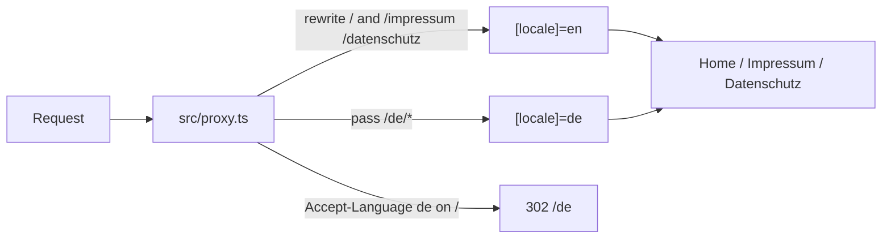

# Convert personal site to Next.js

The site is a Vite SPA ([`package.json`](package.json), [`src/App.tsx`](src/App.tsx)) with client-side routing, client-side language switching, and client-side meta-tag mutation ([`src/components/SEOHead.tsx`](src/components/SEOHead.tsx)). Next.js is a good fit: six static routes, two locales, already on Vercel.

**Defaults (no extra libraries):** Next.js 16 App Router, React 19, keep Tailwind CSS v3, keep [`src/content/translations.ts`](src/content/translations.ts), no `next-intl`. Do not use `output: 'export'` — stay on the Vercel Next.js runtime so `next/image` and Analytics work.

## Target routing (URLs stay the same)



Public URLs stay:

- `/`, `/impressum`, `/datenschutz` (English)
- `/de`, `/de/impressum`, `/de/datenschutz` (German)

Filesystem uses a single `[locale]` tree. English is unprefixed via **rewrite** (not a visible `/en` URL). German browsers hitting `/` still redirect to `/de` (today this is a client `useEffect`; move it into `proxy.ts` so it happens before HTML). Skip the redirect for known crawlers so Google can index `/` as English via hreflang.

**Gotcha:** delete unused [`src/pages/Datenschutz.tsx`](src/pages/Datenschutz.tsx) first. A leftover `src/pages/` directory can make Next.js treat the project as Pages Router.

## Target tree

```
src/
  proxy.ts
  app/
    layout.tsx              # html/body, CSS, Analytics, JSON-LD, viewport
    sitemap.ts
    robots.ts
    not-found.tsx
    [locale]/
      layout.tsx            # lang, nav, footer; generateStaticParams
      page.tsx              # home sections
      impressum/page.tsx
      datenschutz/page.tsx
  lib/
    i18n.ts                 # locales, defaultLocale, localizedPath, t()
    seo.ts                  # titles, descriptions, alternates
  components/               # existing components, lightly adapted
  content/translations.ts   # unchanged copy
```

Root layout sets `<html>` / `<body>`. Locale layout sets `lang` from params (replaces `document.documentElement.lang`).

## Config and dependency swap

In place (keep git history). Do **not** run `create-next-app` — it would pull Tailwind v4 and fight the current CSS.

- Add `next`, upgrade `react` / `react-dom` to 19, add `eslint-config-next`.
- Switch Analytics to `@vercel/analytics/next` in the root layout.
- Remove Vite stack: `vite`, `@vitejs/plugin-react-swc`, `react-router-dom`, `eslint-plugin-react-refresh`, [`index.html`](index.html), [`vite.config.ts`](vite.config.ts), [`src/main.tsx`](src/main.tsx), [`src/App.tsx`](src/App.tsx), [`src/vite-env.d.ts`](src/vite-env.d.ts), [`tsconfig.app.json`](tsconfig.app.json), [`tsconfig.node.json`](tsconfig.node.json).
- Replace [`vercel.json`](vercel.json) SPA rewrites (they exist only to serve `index.html`). Next handles these routes; the file can go unless something else needs it.
- Point Tailwind `content` at `src/app/**` and `src/components/**`.
- Use a standard Next `tsconfig.json` (`jsx: "preserve"`, `plugins: [{ "name": "next" }]`, `@/*` paths).
- Replace ESLint with `eslint-config-next` (drop the Vite-only `react-refresh` rule).
- Scripts: `"dev": "next dev"`, `"build": "next build"`, `"start": "next start"`.

## i18n without a library

Keep [`translations.ts`](src/content/translations.ts). Extract a small [`src/lib/i18n.ts`](src/lib/i18n.ts):

- `locales = ['en', 'de']`, `defaultLocale = 'en'`
- `t(locale, key)` — same lookup as today’s context
- `localizedPath(locale, path)` → `/impressum` vs `/de/impressum`

Delete [`LanguageContext`](src/context/LanguageContext.tsx) and [`useLanguage`](src/hooks/useLanguage.ts). Locale comes from the URL (`params.locale`), not client state. Language switcher only navigates (same behavior as [`LanguageSwitcher.tsx`](src/components/LanguageSwitcher.tsx) today). Drop `localStorage` language writes unless we later want “German browser but prefer English on `/`” to persist via a cookie — current App.tsx already ignores localStorage on the `/` → `/de` redirect.

`src/proxy.ts` (Next.js 16 name for middleware):

- Ignore `_next`, static files, `favicon`, etc.
- If path starts with `/de`, continue.
- If path is `/`, `/impressum`, or `/datenschutz`: rewrite internally to `/en...` (except Accept-Language `de` on `/` → redirect to `/de`).
- Invalid locales → `notFound()`.

Every `[locale]` layout/page: `const { locale } = await params` (async params in Next 16), `generateStaticParams()` returning `en` and `de`.

## Server vs client components

Pages stay Server Components so metadata and copy are in the HTML (today crawlers mostly see English from [`index.html`](index.html)).

Mark `'use client'` only where the DOM/router is required:

- [`Navigation.tsx`](src/components/Navigation.tsx) — scroll spy, sticky header, section jump
- [`Footer.tsx`](src/components/Footer.tsx) — section jump
- [`LanguageSwitcher.tsx`](src/components/LanguageSwitcher.tsx)
- Hero CTA — either mark Hero client, or split a tiny `ScrollToContactButton`

Swap `react-router-dom` (`Link`, `useNavigate`, `useLocation`) for `next/link` and `next/navigation` (`useRouter`, `usePathname`).

Pass `locale` into client components as a prop (or derive from `usePathname()`). Content sections ([`About`](src/components/About.tsx), [`Projects`](src/components/Projects.tsx), [`Skills`](src/components/Skills.tsx), [`Contact`](src/components/Contact.tsx), [`Impressum`](src/components/Impressum.tsx), [`Datenschutz`](src/components/Datenschutz.tsx)) become server components that call `t(locale, key)`.

`window.scrollTo(0, 0)` on legal pages can go — App Router already scrolls to top on navigation.

## SEO (the main win)

Replace [`SEOHead.tsx`](src/components/SEOHead.tsx) and the static `<head>` in [`index.html`](index.html) with the Metadata API.

- Root [`layout.tsx`](src/app/layout.tsx): `metadataBase: https://lucasaur.com`, `title.template`, `viewport` (`themeColor: #1e3a8a`), icons, manifest, JSON-LD `<script>` blocks (Person + ProfessionalService — copy from index.html).
- Per-page `generateMetadata({ params })`: localized title/description, `canonical`, `alternates.languages` (`en` / `de` / `x-default`), Open Graph + Twitter. Same strings SEOHead uses today.
- [`src/app/sitemap.ts`](src/app/sitemap.ts) replaces [`public/sitemap.xml`](public/sitemap.xml) (include hreflang alternates for home; add `/de/impressum` and `/de/datenschutz` if we want them indexed).
- [`src/app/robots.ts`](src/app/robots.ts) replaces [`public/robots.txt`](public/robots.txt).

## Images

Use `next/image`:

- Hero `/me.jpeg` — `priority` (LCP)
- Project screenshots — default lazy

Keep files in `public/` (`me.jpeg`, `databites.png`, `certus-ai.png`, `image2.png`, `favicon.svg`, `manifest.json`). No remote image config needed.

## What not to change

- Visual design, Tailwind tokens in [`src/index.css`](src/index.css) / [`tailwind.config.js`](tailwind.config.js)
- Copy in translations and legal pages
- Cal.com / mailto / GitHub / LinkedIn links
- No new fonts (`next/font` only if we add a custom font later)

## Verify

After `next build` is green:

- `/`, `/de`, `/impressum`, `/de/impressum`, `/datenschutz`, `/de/datenschutz`
- Language switcher round-trip on home and legal pages
- Nav/footer section scroll on home; nav from a legal page back to home
- View-source (not DevTools after hydration): German title/description on `/de`, English on `/`
- Images render; Vercel Analytics script present
- Unknown path → 404, not a silent redirect to `/` (today `*` goes home; Next `not-found.tsx` is the better default)

No browser MCP in this planning pass; during implementation, exercise those routes in the browser, not just a screenshot.